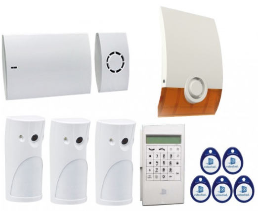

# RSI Videofied tcp / mqtt gateway

This is a simple gateway between RSI Videofied alarm system and MQTT server.
!! I only tested with the RSI protocol V2 !!
It's integrated with [Home Assistant](https://github.com/home-assistant/home-assistant) (automatic creation of sensors through MQTT)



# Installation
## Docker compilation
```
docker build -t mickaelh51/rsimqttgateway .
```
## Docker run (in test mode)
```
docker run --rm -i -t -p 888:888 --name rsigwalarm mickaelh51/rsimqttgateway:latest
In debug mode:
docker run --rm -i -t -p 888:888 -e loglevel=DEBUG --name rsigwalarm mickaelh51/rsimqttgateway:latest
```

## Docker image:
[https://hub.docker.com/r/mickaelh51/rsimqttgateway](https://hub.docker.com/r/mickaelh51/rsimqttgateway)

### Pull from docker hub
#### For linux/amd64
```
docker pull mickaelh51/rsimqttgateway:latest
```

#### For Raspberry PI (not tested)
```
docker pull mickaelh51/rsimqttgateway:rpi
```

#### You can mount config.json as volume with
```
./config.json:/usr/src/app/config.json
```

# Alarm configuration
Please, backup actual configuration before any changes !!

## FR (documentations/WIP2x0_InstallationGuide_FR.pdf)
- 4. PARAMETRES ETHRENET (P21)
- 5. CODES ALARME (P22)
-- Tout mettre à "ALARME ET FIN"
- 2. PROGRAMMATION DE LA CENTRALE W (P9)
-- TELESURVEILLANCE
-- ADRESSES SERVEUR -> Docker address
-- PORT --> 888

## EN (documentations/WIP2x0_InstallationGuide_EN.pdf)

# Gateway configuration (config.json)
```json
{
  "socket_bind": "",
  "socket_listen_port": 888,
  "socket_timeout" : 5.0,
  "mqtt_host": "192.168.1.1",
  "mqtt_port": 1883,
  "mqtt_prefix": "homeassistant",
  "home_assistant_integration": 1, ==> if 1, at startup, the sensors bellow will be created in HA.
  "home_assistant_sensors":
  {
    "alarm_arm": { "device_class": "lock", "default_state": "ON", "sensor_type": "binary_sensor" },
    "alarm_arm_source": { "device_class": "None", "default_state": "nobody", "sensor_type": "sensor" },
    "alarm_power": { "device_class": "plug", "default_state": "ON", "sensor_type": "binary_sensor" },
    "alarm_autoprotection": { "device_class": "safety", "default_state": "OFF", "sensor_type": "binary_sensor" },
    "alarm_autoprotection_source": { "device_class": "None", "default_state": "nothing", "sensor_type": "sensor" },
    "alarm_alert": { "device_class": "problem", "default_state": "OFF", "sensor_type": "binary_sensor" },
    "alarm_alert_source": { "device_class": "None", "default_state": "nothing", "sensor_type": "sensor" }
  },
  "mapping_events":
  {
    "1": { "type": "alarm_alert", "state": "ON", "comment": "alarm alert !", "device_index": 1  },
    "3": { "type": "alarm_autoprotection", "state": "ON", "comment": "autoprotection !", "device_index": 1  },
    "4": { "type": "alarm_autoprotection", "state": "OFF", "comment": "autoprotection recovery" },
    "6": { "type": "alarm_5_wrong_codes", "state": "OFF", "comment": "5 wrong codes" },
    "19": { "type": "alarm_power", "state": "OFF", "comment": "ac power lost" },
    "20": { "type": "alarm_power", "state": "ON", "comment": "ac power recovery" },
    "24": { "type": "alarm_arm", "state": "OFF", "comment": "armed", "mapping_users": 1 },
    "25": { "type": "alarm_arm", "state": "ON", "comment": "disarmed", "mapping_users": 1 },
    "27": { "type": "alarm_alert", "state": "OFF", "comment": "intrusion ack" }
  },
  "mapping_users":
  {
    "1": "Manon",
    "2": "Mickael",
    "3": "Allan"
  },
  "device_index": { ==> detectors
    "1": { "name" : "Keypad entrance", "zone": 1 },
    "2": { "name" : "IR entrance", "zone": 1 },
    "3": { "name" : "Door entrance", "zone": 1 },
    "4": { "name" : "Indoor siren", "zone": 1 },
    "5": { "name" : "IR stage 1", "zone": 3 },
    "6": { "name" : "Outdoor siren", "zone": 1 },
    "62": { "name" : "Panel", "zone": 2 }
  },
  "zones": {
    "1": { "name" : "Entrance"},
    "2": { "name" : "Living room"},
    "3": { "name" : "Stage 1"},
    "4": { "name" : "Basement"}
  }
}
```

# Test server
You can send specifics events to test the server. You can find a test script in tests/test_server_python2.py
```
python2.7 tests/test_server_python2.py
```

# My events list (have to change with your own system)
You have to test your own system with arm / disarm / open panel etc .. to find the corrects IDs, please start container in DEBUG mode.
FYI: I haven't all events yet

| Events ID | Events | Remarks |
|--|--|--|
|EVENT,1,2,1|Intrusions detected|1 = Events ID / 2 = Device Index / 1 = Detector Index|
|EVENT,3,62,0|autoprotection start|3 = Events ID / 62 = Device Index / 0 = ??? |
|EVENT,4|autoprotection end|4 = Events ID |
|EVENT,5,1,0|panic buttons|5 = Events ID / 1 = ?? / 0 = ?? |
|EVENT,6|5 wrong codes|6 = Events ID |
|EVENT,7,1,3|disarmed with duress code +1|7 = Events ID / 1 = ?? / 3 = ??|
|EVENT,8,1,3|armed with duress code +2|8 = Events ID / 1 = ?? / 3 = ??|
|EVENT,15|Battery low level|15 = Events ID |
|EVENT,16|After event 15, Battery OK|16 = Events ID |
|EVENT,19|AC power loss|19 = Events ID |
|EVENT,20|AC power recovery|20 = Events ID |
|EVENT,24,1,3|Armed|24 = Events ID / 1 = ?? / 3 = user ID |
|EVENT,25,0,3|Disarmed|25 = Events ID / 0 = ?? / 3 = user ID |
|EVENT,26|cyclic test|26 = Events ID|
|EVENT,27|After disarm confirmation of intrusion detected|27 = Events ID |

# Panel tested firmwares
- 07.03.19.03859C
- 09.01.49.0203809

# Ex of startup logs
```
[2020-01-02 20:58:13,673] - server - INFO - Socket created
[2020-01-02 20:58:13,674] - mqtt - INFO - Trying MQTT connection to 192.168.1.1:1883
[2020-01-02 20:58:13,687] - mqtt - INFO - Connected to MQTT broker
[2020-01-02 20:58:13,687] - mqtt - INFO - Send configuration to MQTT broker for alarm_arm
[2020-01-02 20:58:13,687] - mqtt - INFO - Send default state (ON) to MQTT broker for alarm_arm
[2020-01-02 20:58:13,687] - mqtt - INFO - Send configuration to MQTT broker for alarm_arm_source
[2020-01-02 20:58:13,688] - mqtt - INFO - Send default state (nobody) to MQTT broker for alarm_arm_source
[2020-01-02 20:58:13,688] - mqtt - INFO - Send configuration to MQTT broker for alarm_power
[2020-01-02 20:58:13,688] - mqtt - INFO - Send default state (ON) to MQTT broker for alarm_power
[2020-01-02 20:58:13,688] - mqtt - INFO - Send configuration to MQTT broker for alarm_autoprotection
[2020-01-02 20:58:13,688] - mqtt - INFO - Send default state (OFF) to MQTT broker for alarm_autoprotection
[2020-01-02 20:58:13,689] - mqtt - INFO - Send configuration to MQTT broker for alarm_autoprotection_source
[2020-01-02 20:58:13,689] - mqtt - INFO - Send default state (nothing) to MQTT broker for alarm_autoprotection_source
[2020-01-02 20:58:13,689] - mqtt - INFO - Send configuration to MQTT broker for alarm_alert
[2020-01-02 20:58:13,689] - mqtt - INFO - Send default state (OFF) to MQTT broker for alarm_alert
[2020-01-02 20:58:13,689] - mqtt - INFO - Send configuration to MQTT broker for alarm_alert_source
[2020-01-02 20:58:13,690] - mqtt - INFO - Send default state (nothing) to MQTT broker for alarm_alert_source
[2020-01-02 20:58:13,690] - server - INFO - Socket now listening
```

# Events logs
```
[2020-01-02 20:58:56,225] - server - INFO - ### Connected with 172.17.0.1:51766 ###
[2020-01-02 20:58:56,226] - server - INFO - Start new thread: 140423145913120
[2020-01-02 20:58:56,226] - server - INFO - Number of threads: 3
[2020-01-02 20:58:56,227] - utils - INFO - serial: ***********
[2020-01-02 20:58:56,227] - utils - INFO - key: *********
[2020-01-02 20:58:56,229] - utils - INFO - Generate new challenge: *********
[2020-01-02 20:58:56,271] - utils - INFO - Key response to alarm: *********
[2020-01-02 20:58:56,271] - utils - INFO - Answer: AUTH_SUCCESS,*********,1,20191222163159,5,2,*********,0,*********,0,*********,1932
[2020-01-02 20:58:56,272] - utils - INFO - Logging successful !!
[2020-01-02 20:58:56,315] - server - INFO - We received EVENT: EVENT,1,3,2
[2020-01-02 20:58:56,316] - server - INFO - Received update from alarm (alarm alert !) update MQTT / source of event (Door entrance) / zone of event (Entrance)
[2020-01-02 20:58:59,275] - server - INFO - We received EVENT: EVENT,27
[2020-01-02 20:58:59,276] - server - INFO - Received update from alarm (intrusion ack) update MQTT / source of event (None) / zone of event (None)
[2020-01-02 20:59:02,276] - server - INFO - We received EVENT: EVENT,24,1,3
[2020-01-02 20:59:02,278] - server - INFO - Received update from alarm (armed) update MQTT / source of event (Spare) / zone of event (None)
[2020-01-02 20:59:05,279] - server - INFO - We received EVENT: EVENT,25,0,2
[2020-01-02 20:59:05,279] - server - INFO - Received update from alarm (disarmed) update MQTT / source of event (Mickael) / zone of event (None)
[2020-01-02 20:59:08,282] - server - INFO - We received EVENT: EVENT,3,62,0
[2020-01-02 20:59:08,284] - server - INFO - Received update from alarm (autoprotection !) update MQTT / source of event (Panel) / zone of event (Living room)
[2020-01-02 20:59:11,284] - server - INFO - We received EVENT: EVENT,4
[2020-01-02 20:59:11,285] - server - INFO - Received update from alarm (autoprotection recovery) update MQTT / source of event (None) / zone of event (None)
[2020-01-02 20:59:14,284] - server - INFO - We received EVENT: EVENT,19
[2020-01-02 20:59:14,285] - server - INFO - Received update from alarm (ac power lost) update MQTT / source of event (None) / zone of event (None)
[2020-01-02 20:59:17,288] - server - INFO - We received EVENT: EVENT,20
[2020-01-02 20:59:17,289] - server - INFO - Received update from alarm (ac power recovery) update MQTT / source of event (None) / zone of event (None)

```

